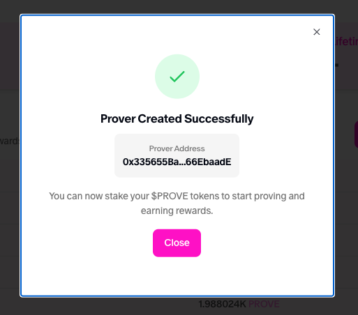
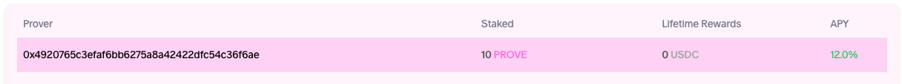

# Getting Started

## Prerequisites

- [A GPU machine](https://docs.succinct.xyz/docs/sp1/generating-proofs/hardware-acceleration)
- [A wallet with sepolia ETH](https://sepolia-faucet.pk910.de/)

## Step 1: Create a prover

Go to: [https://staging.succinct.xyz/stake](https://staging.succinct.xyz/stake)

Click on "Create Prover" on the top right. Make a note of the address of your newly created prover.



The prover will show up in the table after the transaction is confirmed.

## Step 2: Stake to your prover

Ask Succinct to stake $PROVE with your prover, or ask them for $PROVE and stake it yourself.

This can be accomplished by clicking on your prover in the table, and then submitting the stake
transaction.



A staked prover will have some non-zero amount of $PROVE staked.

## Step 3: Calibrate your prover

Ensure you have cloned this repository to a GPU machine.

Then you need to determine your expected throughput and bid amount:

```sh
cd bin/cli

cargo run -- calibrate
```

An example output:

```sh

███████╗██╗   ██╗ ██████╗ ██████╗██╗███╗   ██╗ ██████╗████████╗
██╔════╝██║   ██║██╔════╝██╔════╝██║████╗  ██║██╔════╝╚══██╔══╝
███████╗██║   ██║██║     ██║     ██║██╔██╗ ██║██║        ██║
╚════██║██║   ██║██║     ██║     ██║██║╚██╗██║██║        ██║
███████║╚██████╔╝╚██████╗╚██████╗██║██║ ╚████║╚██████╗   ██║
╚══════╝ ╚═════╝  ╚═════╝ ╚═════╝╚═╝╚═╝  ╚═══╝ ╚═════╝   ╚═╝

Welcome to the Succinct Prover Node CLI! You're about to start your proving journey.

Fire up your machine and join a global network of provers where your compute helps prove the world's software.

Learn more: https://docs.succinct.xyz


Calibration Results:
┌───────────────────┬──────────────────────────────┐
│ Metric            │ Value                        │
├───────────────────┼──────────────────────────────┤
│ Prover Throughput │ 945856.7406582063 gas/second │
├───────────────────┼──────────────────────────────┤
│ Recommended Bid   │ 1 gas per USDC               │
└───────────────────┴──────────────────────────────┘
```

## Step 4: Run the prover

With your prover created, you're now ready to run the code in this repository.

You'll first need to determine the following:

- `RPC_URL` is the URL of the Succinct Prover Network RPC.
- `THROUGHPUT` is the throughput of your prover, retrieved from the calibration step.
- `BID_AMOUNT` is the amount of gas per USDC unit (where 1e6 USDC units = $1), retrieved from the calibration
  step. A higher bid amount will increase your chance of winning auctions, but will also reduces the
  amount you earn per gas proven.
- `PRIVATE_KEY` corresponds to the wallet that you created the prover with. This can be retrieved by
going into your wallet and clicking on the "Export Private Key" button, then copying the private key.

Once you know all of these values, you can set them as environment variables:

```sh
export RPC_URL=https://rpc-production.succinct.xyz
export THROUGHPUT=945855
export BID_AMOUNT=1
export PRIVATE_KEY=0x...
```

Then, you can run the following command to generate proofs:

```sh
cargo run -- prove --rpc-url $RPC_URL --throughput $THROUGHPUT --bid-amount $BID_AMOUNT --private-key $PRIVATE_KEY
```

After some initial setup time, you should start to see your prover bidding in auctions. If the
auction for a request is won, you will generate a proof for it.

An example output:

```sh

███████╗██╗   ██╗ ██████╗ ██████╗██╗███╗   ██╗ ██████╗████████╗
██╔════╝██║   ██║██╔════╝██╔════╝██║████╗  ██║██╔════╝╚══██╔══╝
███████╗██║   ██║██║     ██║     ██║██╔██╗ ██║██║        ██║
╚════██║██║   ██║██║     ██║     ██║██║╚██╗██║██║        ██║
███████║╚██████╔╝╚██████╗╚██████╗██║██║ ╚████║╚██████╗   ██║
╚══════╝ ╚═════╝  ╚═════╝ ╚═════╝╚═╝╚═╝  ╚═══╝ ╚═════╝   ╚═╝

Welcome to the Succinct Prover Node CLI! You're about to start your proving journey.

Fire up your machine and join a global network of provers where your compute helps prove the world's software.

Learn more: https://docs.succinct.xyz

  2025-05-09T19:15:23.220024Z  INFO  Starting Node on Succinct Network..., wallet: 0xCe0cB82A21C929B5070067BDa715E169eb10CABb, rpc: https://rpc-production.succinct.xyz, throughput: 10000000, bid_amount: 1

  2025-05-09T19:20:49.452114Z  INFO  [SerialBidder] At least one assigned proof request found. Skipping the bidding process for now.

  2025-05-09T19:20:49.453471Z  INFO  [SerialProver] Fetched assigned proof requests., count: 1

  2025-05-09T19:20:49.666128Z  INFO  [SerialProver] Proving request..., request_id: a56e3565919cb373636718c4f78d44dbe3d0af82444d96485248fda3d87e6c3e, vk_hash: 0018b32c74d38cdbbcf62bd30414e413fdd5553ed5d33e9ea432a11d6d7ebcf8, version: sp1-v4.0.0-rc.3, mode: 2, strategy: 3, requester: fe9d83abedfd94a50959a6ffbc362bf58879f8a7, tx_hash: f0540a895c53d04292086adc21b27790431de7739a94a4d6647ab37529471b69, program_uri: https://artifacts.production.succinct.xyz/programs/artifact_01jmds7qsae29tmkgrv0hhdgh3, stdin_uri: https://artifacts.production.succinct.xyz/stdins/artifact_01jtv7tm61fjsae9cxea76h46p, cycle_limit: 1249, created_at: 1746818388, created_at_utc: 2025-05-09 19:19:48 UTC, deadline: 1746818688, deadline_utc: 2025-05-09 19:24:48 UTC

  2025-05-09T19:20:49.741733Z  INFO  [SerialProver] Downloaded program., program_size: 106052, artifact_id: 61727469666163745f30316a6d647337717361653239746d6b67727630686864676833

  2025-05-09T19:20:49.873730Z  INFO  [SerialProver] Downloaded stdin., stdin_size: 8, artifact_id: 61727469666163745f30316a747637746d3631666a7361653963786561373668343670

  2025-05-09T19:20:49.873889Z  INFO  [SerialProver] Setting up proving key...

  2025-05-09T19:20:54.606231Z  INFO  [SerialProver] Set up proving key., duration: 4.732347794

  2025-05-09T19:20:54.606302Z  INFO  [SerialProver] Executing program...

  2025-05-09T19:20:54.699036Z  INFO  [SerialProver] Executed program., duration: 0.092730615, cycles: 1249

  2025-05-09T19:20:54.699065Z  INFO  [SerialProver] Generating proof...

  2025-05-09T19:20:59.102089Z  INFO  [SerialProver] Proof generation complete., duration: 4.40300406, cycles: 1249

  2025-05-09T19:20:59.148381Z  INFO  [SerialProver] Fetched account nonce., nonce: 219

  2025-05-09T19:20:59.864674Z  INFO  [SerialProver] Proof fulfillment submitted., request_id: a56e3565919cb373636718c4f78d44dbe3d0af82444d96485248fda3d87e6c3e, proof_size: 1315535
```