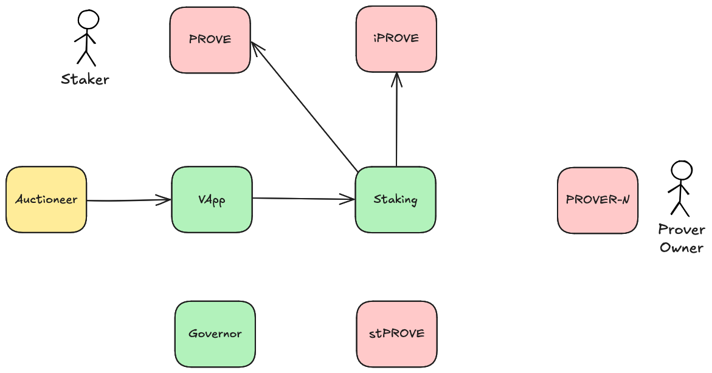
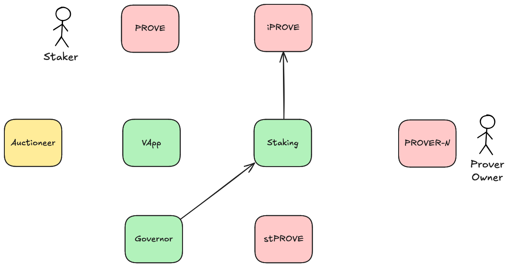

# Design

This document describes the onchain Succinct Prover Network in detail.

## Contracts

The protocol consists of the following core contracts:

* [Succinct](./src/tokens/Succinct.sol) "Succinct ($PROVE)" - The primary ERC20 token.
* [IntermediateSuccinct](./src/tokens/IntermediateSuccinct.sol) "IntermediateSuccinct ($iPROVE)" - The ERC4626 token with $PROVE as the underlying. Non-transferable outside of staking operations.
* [SuccinctProver](./src/tokens/SuccinctProver.sol) "Prover-N ($PROVER-N)" - The ERC4626Rewards token with $iPROVE as the underlying. Each prover has their own deployment of this contract, and `N` is replaced with an incrementing number representing the prover's ID. Non-transferable outside of staking operations.
* [SuccinctStaking](./src/SuccinctStaking.sol) "StakedSuccinct ($stPROVE)" - The staking receipt ERC20 token, containing the logic for staking, unstaking, slashing, and dispensing. For the purposes of this document, $stPROVE treated as distinct from the staking contract logic, but they are actually combined into a single contract. Non-transferable outside of staking operations, and acts as the Governance token.
* [SuccinctVApp](./src/SuccinctVApp.sol) - Handles settlement of the offchain VApp transactions and is responsible for deposits, withdrawals, and triggering slashing.
* [SuccinctGovernor](./src/SuccinctGovernor.sol) - The governor for on-chain governance, using $stPROVE as the votes token.

## Operations

The protocol contracts have several core operations that can occur:

* [Stake](./#stake)
* [Unstake](./#unstake)
* [Slash](./#slash)
* [Dispense](./#dispense)

In the diagrams below, protocol tokens/vaults are shown in red, protocol logic contracts are shown in green, reward tokens are shown in blue, and off-chain systems are shown in yellow.

### Stake

Triggered by a staker calling either [SuccinctStaking.stake()](./src/SuccinctStaking.sol#L160) or [SuccinctStaking.permitAndStake()](./src/SuccinctStaking.sol#L170), specifying the prover to stake to and the amount of $PROVE to stake.

This deposits $PROVE from the staker into the $iPROVE vault (minting $iPROVE), and then takes that $iPROVE and deposits it into the chosen $PROVER-N vault (minting $PROVER-N). The staking contract escrows this $PROVER-N, while minting $stPROVE to the staker (which acts as the receipt token for staking).

A staker can only stake to one prover at a time, and must fully unstake if they need to change provers.

After this operation, the staker receives a corresponding amount of $stPROVE.

### Unstake

Triggered by a staker calling [SuccinctStaking.requestUnstake()](./src/SuccinctStaking.sol#L186), waiting for [SuccinctStaking.unstakePeriod()](./src/SuccinctStaking.sol#L34) seconds to pass, and then calling [SuccinctStaking.finishUnstake()](./src/SuccinctStaking.sol#L219).

This burns the staker's $stPROVE, and then withdraws the $iPROVE from the $PROVER-N vault (burning $PROVER-N), and then withdraws the $PROVE from the $iPROVE vault (burning $iPROVE).

This will also automatically claim any prover rewards accrued.

After this finishing this operation, the staker receives a corresponding amount of $PROVE.

### Slash

First triggered by the Auctioneer/VApp calling [SuccinctStaking.requestSlash()](./src/SuccinctStaking.sol#L253). Then, the [SuccinctStaking.owner()](./src/SuccinctStaking.sol#L56) can process the requested slash either by cancelling it via [SuccinctStaking.cancelSlash()](./src/SuccinctStaking.sol#L281) or, if [SuccinctStaking.slashPeriod()](./src/SuccinctStaking.sol#L37) seconds have passed, it can be finished via [SuccinctStaking.finishSlash()](./src/SuccinctStaking.sol#L300).

If the latter, burns the selected prover vault's corresponding $iPROVE and $PROVE.

After finishing this operation, the prover's stakers will have a decreased amount of staked $PROVE.

### Dispense

Triggered by the [SuccinctStaking.owner()](./src/SuccinctStaking.sol#L56) calling [SuccinctStaking.dispense()](./src/SuccinctStaking.sol#L330), specifying the amount of $PROVE to dispense.

This moves $PROVE from the staking contract to the $iPROVE vault, effectively distributing the $PROVE to all stakers.

The maximum amount of dispense is defined as [SuccinctStaking.maxDispense()](./src/SuccinctStaking.sol#L150), which is bounded by the [dispenseRate](./src/SuccinctStaking.sol#L40). Dispense rate can also be changed by the owner via [SuccinctStaking.updateDispenseRate()](./src/SuccinctStaking.sol#L354).

It is assumed that the staking contract has ownership of this much $PROVE. Operationally, the staking contract will need to be periodically topped up with $PROVE to cover the dispense rate.

After this operation, all stakers will have an increased amount of withdrawable $PROVE.